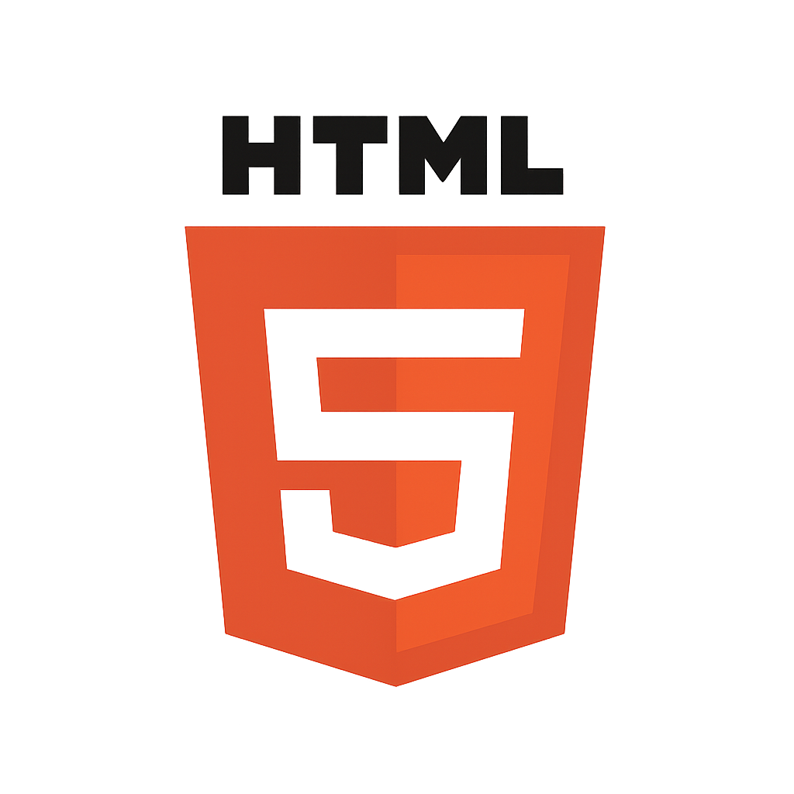

# Desafio DIO: O que aprendi em HTML

Este projeto foi desenvolvido como parte do desafio proposto no curso de HTML da [DIO (Digital Innovation One)](https://www.dio.me/). O objetivo era criar uma página web explicando, de forma prática, o que cada **tag HTML** representa e como é utilizada na construção de sites.

## 🧠 O que foi feito

- Estruturação completa de uma página HTML
- Criação de seções explicativas para diversas tags HTML
- Aplicação de CSS para deixar o conteúdo visualmente mais agradável
- Organização semântica dos elementos da página

## 🏷️ Tags abordadas

O site explica o uso das seguintes tags:

- `
` — Parágrafos
- `<h1>` até `<h6>` — Títulos e Subtítulos
- `<a>` — Links
- `` — Imagens
- `<ul>` e `<li>` — Listas
- E outras tags comuns no HTML

## 🖼️ Preview do projeto

## 🚀 Tecnologias utilizadas

- HTML5
- CSS3

## 🌐 Acesse o site publicado

Você pode ver o resultado final aqui:  
👉 [https://sanchessb.github.io/desafio-html-dio/](https://sanchessb.github.io/desafio-html-dio/)

---

Se quiser ver o código-fonte ou deixar uma estrela ⭐, fique à vontade!
